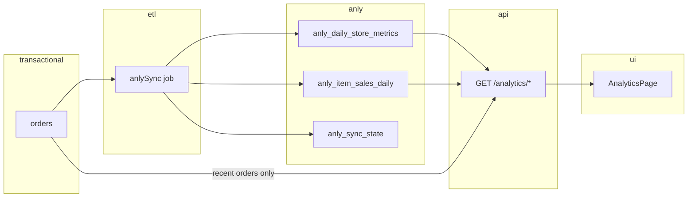

# Admin portal analytics — separate `anly` collections & ETL plan

## 1. Goals

| Goal | Detail |
|------|--------|
| **UI placement** | **Top selling items** and **daily order volume** widgets live under **Admin → Analytics** (`/analytics`), alongside existing revenue/category/promo charts. |
| **Data isolation** | Aggregated metrics are read from Mongo collections whose names use the **`anly` prefix**. They are **not** queried by scanning `orders` for historical ranges. |
| **Freshness** | Historical ranges are served from pre-aggregated data with **minimal delay** (target: within one sync interval, typically 1–5 minutes). |
| **Recent orders** | **Stays on transactional data** (`orders` collection, existing `GET /orders`) — never moved to `anly` tables. |
| **Configurable sync** | ETL period controlled by env (e.g. `ANLY_SYNC_INTERVAL_MS`). |

### Current state (baseline)

- **Admin** `AnalyticsPage` already calls `GET /reports/sales` (full `Order.find` over the date range) and `GET /orders` for recent orders.
- **POS manager** `Dashboard` shows **daily order volume**, **top selling items**, and **recent orders** using the same transactional `/reports/sales` pattern.
- This plan targets **admin portal** first; POS can later call the same analytics APIs or keep transactional reads for “today only” if desired.

---

## 2. Design principles (optimal + low delay)

1. **Pre-aggregate at write-time boundaries (per day, per store)** — O(days in range) reads instead of O(orders).
2. **Incremental ETL with a watermark** — each sync only processes **new/changed completed orders** since the last cursor.
3. **Hybrid read for “today”** (optional but recommended) — API sums `anly_*` for past days and adds a **small transactional slice** for **today only** so the UI is fresh without waiting for the next full sync.
4. **Idempotent upserts** — re-processing the same order updates the same daily keys (safe retries).
5. **Single writer** — ETL job runs on **admin-portal-server** (already has `Order` model and cron-style `setInterval` in `index.js`).



---

## 3. Mongo collections (`anly` prefix)

All in the **same database** as transactional data (`MONGO_URI`). Explicit collection names via Mongoose `collection` option.

### 3.1 `anly_sync_state`

Tracks incremental sync progress (global or per-tenant; **recommend per-tenant** for scale).

| Field | Type | Notes |
|-------|------|--------|
| `tenantId` | ObjectId | Unique |
| `lastSyncedAt` | Date | Max `updatedAt` / `createdAt` seen among processed orders |
| `lastOrderId` | ObjectId | Tie-breaker for same timestamp |
| `lastRunAt` | Date | Job heartbeat |
| `lastError` | String | Optional |
| `backfillCompletedAt` | Date | Set after initial historical load |

### 3.2 `anly_daily_store_metrics`

One document per **tenant + store + calendar day** (server local timezone — same as `reports.js` `localDateKey`).

| Field | Type | Notes |
|-------|------|--------|
| `tenantId`, `storeId` | ObjectId | `storeId` null → single-store tenants |
| `dateKey` | String | `YYYY-MM-DD` local |
| `orderCount` | Number | Completed orders |
| `revenue` | Number | Sum `totalAmount` |
| `discountTotal` | Number | |
| `itemQty` | Number | Optional: total line qty |
| `updatedAt` | Date | |

**Unique index:** `{ tenantId: 1, storeId: 1, dateKey: 1 }`

Powers: **daily order volume** chart, period order count, revenue rollups.

### 3.3 `anly_item_sales_daily`

One document per **tenant + store + day + menu item** (denormalized name/category at sync time).

| Field | Type | Notes |
|-------|------|--------|
| `tenantId`, `storeId` | ObjectId | |
| `dateKey` | String | `YYYY-MM-DD` |
| `menuItemId` | ObjectId | |
| `itemName` | String | Snapshot from order line |
| `category` | String | From line or `MenuItem` lookup (same as today’s reports) |
| `qty` | Number | |
| `revenue` | Number | `price * qty` |
| `updatedAt` | Date | |

**Unique index:** `{ tenantId: 1, storeId: 1, dateKey: 1, menuItemId: 1 }`  
**Query index:** `{ tenantId: 1, storeId: 1, dateKey: 1 }`

Powers: **top selling items** widget (sort by `qty` or `revenue` for range).

### 3.4 Optional later: `anly_promo_daily`

Only if promo breakdown on analytics should also leave transactional scans. **Out of scope for v1** — keep promo stats on existing `/reports/sales` or migrate in v2.

---

## 4. ETL job (`anlySync`)

**Location:** `apps/admin-portal/server/src/jobs/anlySync.js`  
**Scheduler:** `apps/admin-portal/server/src/index.js` — `setInterval` (same pattern as subscription monitor).

### 4.1 Environment variables

Add to `apps/admin-portal/server/.env.example`:

```env
# Analytics ETL (anly_* collections)
ANLY_SYNC_ENABLED=true
# How often to run incremental sync (milliseconds). Default 5 minutes.
ANLY_SYNC_INTERVAL_MS=300000
# On first deploy, backfill this many days of completed orders (0 = incremental only).
ANLY_BACKFILL_DAYS=90
# Max orders processed per sync tick (safety cap).
ANLY_SYNC_BATCH_SIZE=2000
```

| Variable | Default | Purpose |
|----------|---------|---------|
| `ANLY_SYNC_ENABLED` | `true` | Kill switch |
| `ANLY_SYNC_INTERVAL_MS` | `300000` (5 min) | Sync period — **primary latency knob** |
| `ANLY_BACKFILL_DAYS` | `90` | Initial historical population |
| `ANLY_SYNC_BATCH_SIZE` | `2000` | Per-tick cap |

For **minimal delay**, production can set `ANLY_SYNC_INTERVAL_MS=60000` (1 min). Avoid sub-30s unless order volume is low — reduces duplicate work and DB load.

### 4.2 Incremental algorithm (per tenant)

```
1. Load anly_sync_state for tenant (or create).
2. Query orders:
     status = 'completed'
     AND (updatedAt > lastSyncedAt OR (updatedAt = lastSyncedAt AND _id > lastOrderId))
     ORDER BY updatedAt ASC, _id ASC
     LIMIT ANLY_SYNC_BATCH_SIZE
3. For each order:
     dateKey = localDateKey(order.createdAt)   // completedAt if you add it later
     Upsert anly_daily_store_metrics: $inc orderCount, revenue, discountTotal
     For each line item:
       Upsert anly_item_sales_daily: $inc qty, revenue
4. Advance watermark to last processed order.
5. If batch full, schedule immediate follow-up on next tick (natural drain).
```

**Idempotency:** Use `$inc` with **signed deltas** only if you support order edits/cancellations. For v1, if completed orders are immutable, simple `$inc` on first processing is enough. If orders can be voided later, add a **reconciliation pass** or store `orderId` in `anly_order_facts` (v2).

### 4.3 Initial backfill

On startup (once per tenant):

- If `backfillCompletedAt` is null and `ANLY_BACKFILL_DAYS > 0`:
  - Run **aggregation pipeline** on `orders` (single pass, grouped by tenant/store/date/item) for the window `[today - N days, today]`.
  - Bulk `bulkWrite` upserts into `anly_*`.
  - Set `backfillCompletedAt`, then switch to incremental.

Backfill can run **off-peak** or be triggered manually:

`POST /analytics/sync/backfill` (superadmin / internal) — optional.

### 4.4 Why not change streams in v1?

Change streams give near-real-time updates but add **replica set requirements**, resume tokens, and ops complexity. **Incremental polling every 1–5 min** plus **transactional “today” merge** achieves similar UX with less risk. Phase 2 can add `orders` watch for `status → completed` only.

---

## 5. Read API (admin portal)

New router: `apps/admin-portal/server/src/routes/analytics.js`  
Mount: `/analytics` (JWT + `merchant_admin` + `tenantScope` + `resolveSelectedStore`).

### 5.1 `GET /analytics/order-volume`

**Query:** `from`, `to` (YYYY-MM-DD, same validation as `/reports/sales`).

**Logic:**

1. Sum `anly_daily_store_metrics` for `tenantId`, `storeId`, `dateKey ∈ [from, to]`.
2. **(Recommended)** Merge **today** from transactional:

```js
// Only if today ∈ [from, to]
const todayOrders = await Order.countDocuments({
  tenantId, storeId, status: 'completed',
  createdAt: { $gte: startOfToday, $lte: endOfToday },
});
// Replace or add today's bucket in daily[] 
```

3. Return:

```json
{
  "daily": [{ "date": "2026-05-14", "orders": 12, "revenue": 45000 }],
  "orderCount": 84,
  "totalRevenue": 320000,
  "rangeFrom": "...",
  "rangeTo": "...",
  "source": { "historical": "anly", "today": "transactional" }
}
```

### 5.2 `GET /analytics/top-items`

**Query:** `from`, `to`, `limit` (default 10), `sort` (`qty` | `revenue`).

**Logic:**

1. Aggregate `anly_item_sales_daily` with `$match` + `$group` by `menuItemId` / `itemName` across date range.
2. **Today merge:** optional small aggregation on `orders` for today only (line items), merged into totals.
3. Return `{ topItems: [{ name, qty, revenue, menuItemId }], bestSeller }`.

### 5.3 `GET /orders` — unchanged (recent orders)

Keep existing route. Analytics UI:

- **Recent orders:** `GET /orders?limit=10` with `x-store-id`, sort `createdAt` desc, **no dependency on `anly`**.
- `refetchInterval: 30_000` (already on Analytics page) is appropriate.

### 5.4 `GET /reports/sales` — phased split

| Data | v1 source | v2 |
|------|-----------|-----|
| Daily revenue, categories, promos, discounts | Transactional (current) | Can move to `anly_*` later |
| **Order volume** | **`/analytics/order-volume`** | — |
| **Top items** | **`/analytics/top-items`** | — |
| Recent orders | **Transactional `/orders`** | — |

This limits migration risk while fixing the heaviest widgets first.

---

## 6. Admin UI changes (`AnalyticsPage.jsx`)

Add a section below daily revenue (or new row):

| Widget | API | Notes |
|--------|-----|--------|
| **Daily order volume** | `GET /analytics/order-volume` | Bar chart `orders` by day (mirror POS manager dashboard). |
| **Top selling items** | `GET /analytics/top-items` | Ranked list with qty bars (mirror POS). |
| **Recent orders** | `GET /orders` | **Keep as-is** — transactional. |

**UX details:**

- Show small footer: `Analytics updated every {interval} min` using sync metadata from `GET /analytics/status` (optional: `{ lastRunAt, intervalMs }`).
- When today is merged from transactional data, tooltip: “Today’s figures are live; earlier days are pre-aggregated.”

**Do not** add these widgets to `DashboardPage` (stays subscription/quick actions only).

---

## 7. File / module layout

```
apps/admin-portal/server/
  src/
    models/
      AnlySyncState.js          → collection: anly_sync_state
      AnlyDailyStoreMetrics.js  → collection: anly_daily_store_metrics
      AnlyItemSalesDaily.js     → collection: anly_item_sales_daily
    jobs/
      anlySync.js               → runIncrementalSync(), runBackfill()
    lib/
      anlyDateKeys.js           → shared localDateKey (extract from reports.js)
    routes/
      analytics.js              → GET order-volume, top-items, status
    index.js                    → register interval + startup backfill

apps/admin-portal/client/
  src/pages/admin/AnalyticsPage.jsx   → new charts + top items list
```

Shared date helpers: extract `localDateKey`, `parseLocalDateOnly`, `startOfLocalDay` from `reports.js` into `lib/anlyDateKeys.js` to avoid drift.

---

## 8. Performance & indexes

### Transactional (existing — keep for recent orders + today slice)

- `orders`: `{ tenantId: 1, storeId: 1, status: 1, createdAt: -1 }` (already partially covered).

### New `anly` indexes

- `anly_daily_store_metrics`: unique `{ tenantId: 1, storeId: 1, dateKey: 1 }`.
- `anly_item_sales_daily`: unique `{ tenantId: 1, storeId: 1, dateKey: 1, menuItemId: 1 }`, plus `{ tenantId: 1, storeId: 1, dateKey: 1 }`.

### Expected read cost

- 7-day range → 7 daily docs + 1 today count query.
- 90-day top items → aggregation over ≤90×items-per-day documents (bounded), not 10k+ orders.

---

## 9. Rollout plan

| Phase | Work | Risk |
|-------|------|------|
| **1** | Models + indexes + `anlySync` job + env vars + backfill | Low |
| **2** | `/analytics/order-volume` + `/analytics/top-items` + UI widgets | Low |
| **3** | Hybrid “today” transactional merge | Low |
| **4** | (Optional) Move `/reports/sales` aggregates to `anly` | Medium |
| **5** | (Optional) POS manager dashboard → same analytics APIs | Low |

**Deploy steps:**

1. Deploy server with `ANLY_SYNC_ENABLED=true`, run backfill (`ANLY_BACKFILL_DAYS`).
2. Verify `anly_*` counts vs manual spot-check for one tenant/store.
3. Deploy client with new widgets reading `/analytics/*`.
4. Tune `ANLY_SYNC_INTERVAL_MS` based on load (start 300000, lower if needed).

---

## 10. Failure modes & ops

| Issue | Mitigation |
|-------|------------|
| Sync lag | Lower `ANLY_SYNC_INTERVAL_MS`; today merge keeps UI accurate for current day. |
| Job crash mid-batch | Watermark only advances after successful batch; idempotent upserts. |
| Wrong historical data after bug | `POST /analytics/sync/rebuild?from=&to=` truncates `anly_*` keys in range and re-runs aggregation. |
| Multi-instance admin servers | Use **single leader** flag (`ANLY_SYNC_LEADER=1` on one PM2 process) or distributed lock (Redis) — **required if horizontal scaling**. |

---

## 11. Summary

- **Top selling items** and **order volume** move to **Admin Analytics** and read from **`anly_daily_store_metrics`** + **`anly_item_sales_daily`**.
- A **configurable periodic ETL** (`ANLY_SYNC_INTERVAL_MS`) incrementally fills those tables from **`orders`** (completed only).
- **Recent orders** remain **100% transactional** via existing **`GET /orders`**.
- **Minimal delay** is achieved by: short sync interval + **optional live merge for today** + pre-aggregated daily buckets for history — without scanning full order history on each dashboard load.

---

## 12. Acceptance criteria

- [ ] Analytics page shows **Daily order volume** and **Top selling items** for selected store + date range.
- [ ] Historical data served from collections named `anly_*` (verify in Mongo).
- [ ] **Recent orders** list still queries `orders` directly.
- [ ] Changing `ANLY_SYNC_INTERVAL_MS` changes sync frequency (observable via `anly_sync_state.lastRunAt`).
- [ ] 7-day / 30-day analytics page load does **not** run `Order.find` for the full range (only optional today slice + recent orders).
